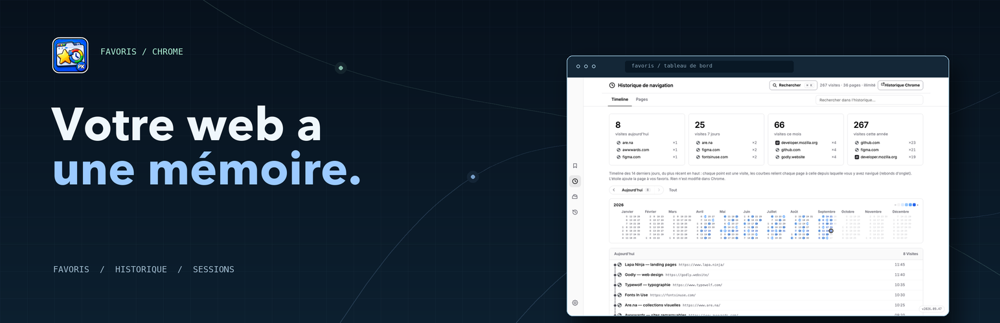
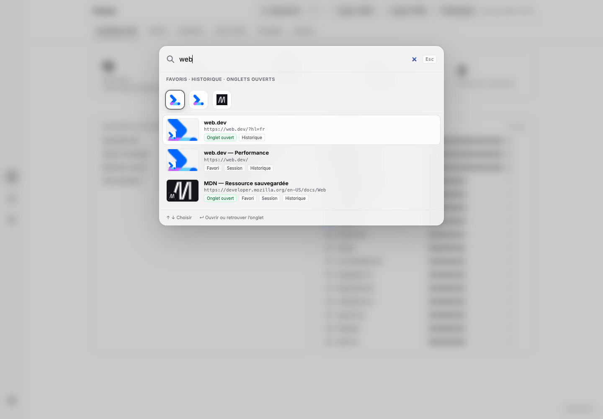
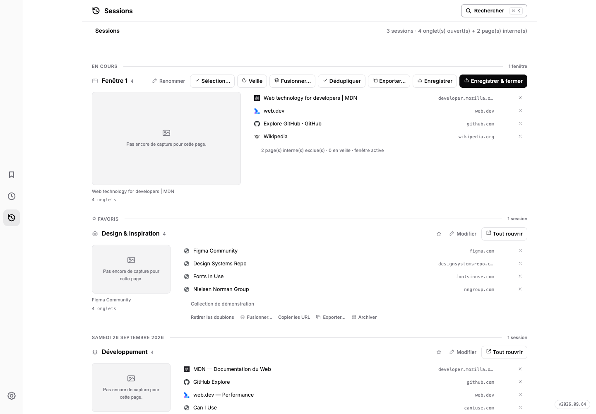

# PK Web Memory




[🇫🇷 Français](README.md) · [🇬🇧 English](README.en.md)

Your browsing life, organized: **bookmarks, history and sessions together in one workspace.** Chrome extension with no build step or dependencies. Version **2026.09.65**.

## Preview





The French-language [store4 website](store4/index.html), copied from `store3` without changing the original, includes eight expandable real screenshots and a full-width playground re-creating the actual dashboard with fictional data: ⌘K search palette grouped by source, inventory, gallery, duplicates with undoable quarantine, sessions (tab close, save & close, duplicate-free restore), full history (visit tiles, clickable heatmap calendar, day navigation) and snapshots. Thumbnails and favicons are real, loaded via mshots and Google S2 just like the extension; everything else stays in page memory — it is not an embedded extension.

Preview: run `python3 -m http.server 4174 --bind 127.0.0.1`, then open `http://127.0.0.1:4174/store4/`.

Regenerate screenshots with `node store4/tools/capture.mjs` (Node 22+ and Chrome for Testing; override the binary with `CHROME_BIN`). The script loads `extension/` into a disposable headless profile, seeds demo bookmarks, visits and sessions through Chrome APIs, and captures the interface without altering its DOM, styles or images. The gallery uses favicon-only mode; the dead-link screen is shown before scanning, without invented results. Backup exports stay inside the temporary profile, which is removed on exit. The [provenance report](store4/tools/capture-report.json) records dimensions, version and source/PNG hashes.

## Install (developer mode)

1. Open `chrome://extensions`
2. Enable **Developer mode** (top right)
3. Click **Load unpacked** → select the `extension/` folder
4. Click the extension icon in the toolbar → the dashboard opens

## Features

| Tab | What it does |
|---|---|
| **Global search** | ⌘K or any keystroke: Spotlight-like palette searching bookmarks, history and open tabs; ↵ opens the site or jumps to its tab |
| **Inventory** | Totals, folder path and domain rankings, frequency bars and favicons |
| **Gallery** | mshots thumbnails with search, folder filter, column count and a 30-day local cache |
| **Duplicates** | 3 levels: 1 · exact URL · 2 · without tracking (utm, fbclid…) · 3 · without http/https, www and params |
| **Dead links** | Parallel scan; only confirmed HTTP 404/410 responses are dead, temporary failures stay under review |
| **Sessions** | Tablerone-style merged timeline: live session always expanded, a cross per row (close the tab or remove the link, undoable), hover page preview, click-to-widen view, save & close, save-only-the-selected-tabs, open-tab dedup (undoable), tab-zero “Resume” card, URL/titles/Markdown/HTML/CSV/JSON export (copy or file), 5-min auto backup and idle-tab sleeping (original URL always kept, Zzz badge, recap and one-click wake) |
| **Backup** | JSON/HTML downloads, local snapshot history with parent links, quarantine management |
| **Icon badge** | Open-tab or duplicate-open-tab count shown on the toolbar icon (choose in settings) |
| **Home page** | Ctrl+T opens the extension on the section of your choice (sessions, gallery, history…) |

## Safety

Gallery screenshots are requested from WordPress.com mshots, which receives the site URL. Retrieved images are cached in extension storage for 30 days (up to 60 entries), then refreshed on demand. Some fallback favicons use Google S2; link scans contact the checked websites without sending their cookies.

Sessions and settings are stored locally. See the [privacy policy](store/privacy-policy.html) and [Chrome Web Store listing brief](store2/description-store.md) for data and permission details.

Links are eligible for quarantine only after 30 days with a confirmed 404/410 status. A rescan that finds them alive or fails temporarily resets the timer. Cleanup moves bookmarks to `Quarantaine — Bookmarks Sorter` with a reason and status. Confirmed dead links are removed automatically after 30 days in quarantine; if they respond again during that window, they are flagged for restoration. Duplicate bookmarks remain restorable until manually purged.

Each export, cleanup, restore, or purge stores a local snapshot (up to 30 versions), linked to its parent. Restoring a snapshot brings back missing bookmarks without deleting newer ones. JSON/HTML exports are downloaded by Chrome and are separate files from this history.

Duplicates always keep the oldest bookmark. `chrome://` pages and local files are never scanned.

## Layout

```
extension/    ← the Chrome extension (manifest.json, index.html, style.css, app.js, sw.js)
store/        ← Chrome Web Store listing, promo assets, demo screenshots, privacy policy
store2/       ← web kit v2 (landing page) — base for the next store
store3/       ← premium landing page (from scratch, pixel-sky direction)
store4/       ← store3 variant: real screenshots, interactive playground, detailed product presentation
src/          ← companion Python pipeline (stdlib: stats + dedupe CLI)
archive/      ← old versions: src3 (sessions merge), first store website
data/         ← exports and working files
backups/      ← timestamped archives
```

## Conventions

- Zero dependencies: vanilla JS on the extension side, Python stdlib on the CLI side.
- Minimal root, no `node_modules`, no build.
- Version `YYYY.MM.PATCH` — see `CHANGELOG.md`.
- See [CHANGELOG](CHANGELOG.md) for the full history.

## Support

A coffee helps keep the project going: [Ko-fi](https://ko-fi.com/pouark).
