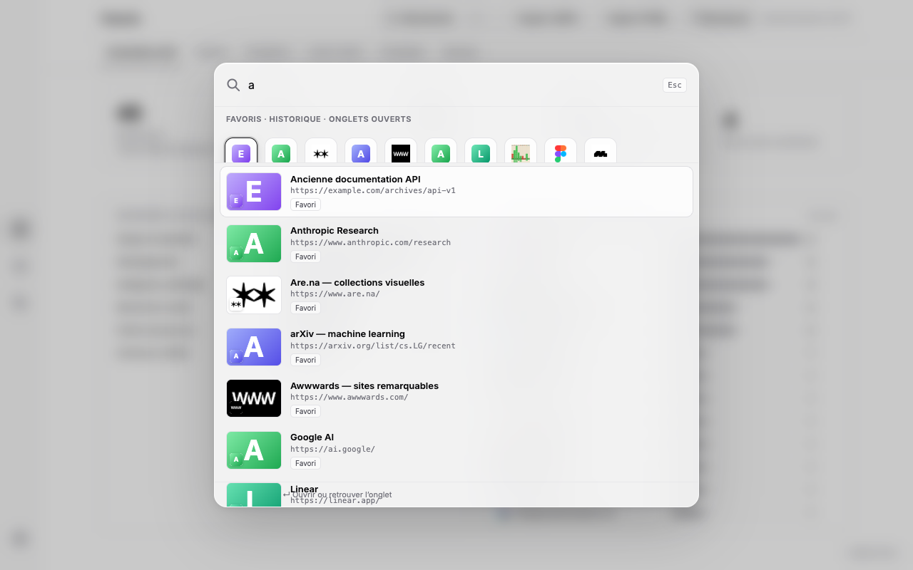
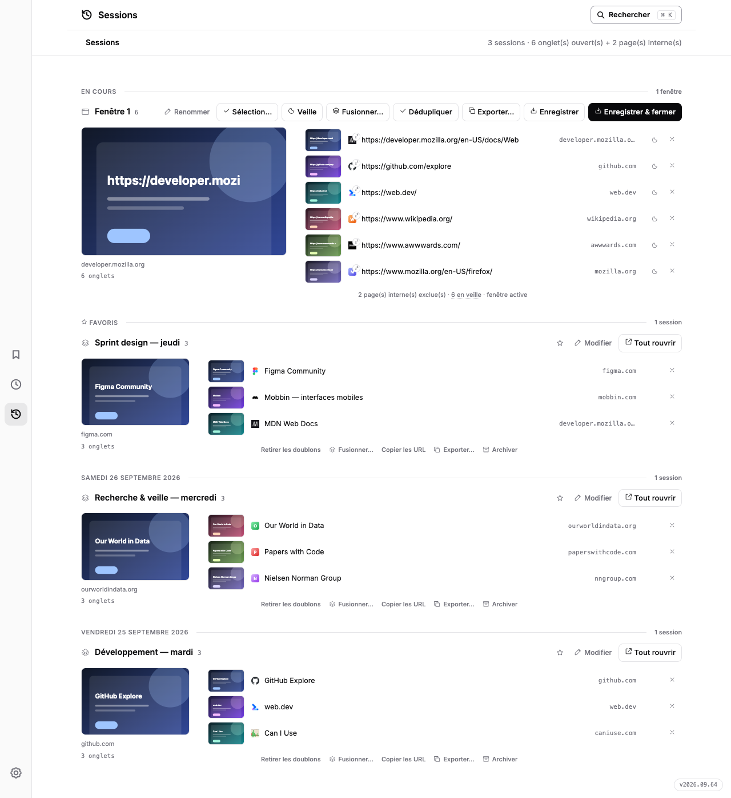

# Favoris


[🇫🇷 Français](README.md) · [🇬🇧 English](README.en.md)

Find, clean up and back up your Chrome bookmarks. **Chrome extension with no build step or dependencies.** Version **2026.09.54**.

## Preview





## Install (developer mode)

1. Open `chrome://extensions`
2. Enable **Developer mode** (top right)
3. Click **Load unpacked** → select the `extension/` folder
4. Click the extension icon in the toolbar → the dashboard opens

## Features

| Tab | What it does |
|---|---|
| **Global search** | ⌘K or any keystroke: Spotlight-like palette searching bookmarks, history and open tabs; ↵ opens the site or jumps to its tab |
| **Inventory** | Totals, folder path and domain rankings, frequency bars and favicons |
| **Gallery** | mshots thumbnails with search, folder filter, column count and a 30-day local cache |
| **Duplicates** | 3 levels: 1 · exact URL · 2 · without tracking (utm, fbclid…) · 3 · without http/https, www and params |
| **Dead links** | Parallel scan; only confirmed HTTP 404/410 responses are dead, temporary failures stay under review |
| **Sessions** | Tablerone-style merged timeline: live session always expanded, a cross per row (close the tab or remove the link, undoable), hover page preview, click-to-widen view, save & close, save-only-the-selected-tabs, tab-zero “Resume” card, URL/titles/Markdown/HTML/CSV/JSON export (copy or file), 5-min auto backup and idle-tab sleeping |
| **Backup** | JSON/HTML downloads, local snapshot history with parent links, quarantine management |
| **Icon badge** | Open-tab or duplicate-bookmark count shown on the toolbar icon (choose in settings) |

## Safety

Gallery screenshots are requested from WordPress.com mshots, which receives the site URL. Retrieved images are cached in extension storage for 30 days (up to 60 entries), then refreshed on demand. Some fallback favicons use Google S2; link scans contact the checked websites without sending their cookies.

Sessions and settings are stored locally. See the [privacy policy](store/privacy-policy.html) and [Chrome Web Store listing brief](store/description-store.md) for data and permission details.

Links are eligible for quarantine only after 30 days with a confirmed 404/410 status. A rescan that finds them alive or fails temporarily resets the timer. Cleanup moves bookmarks to `Quarantaine — Bookmarks Sorter` with a reason and status. Confirmed dead links are removed automatically after 30 days in quarantine; if they respond again during that window, they are flagged for restoration. Duplicate bookmarks remain restorable until manually purged.

Each export, cleanup, restore, or purge stores a local snapshot (up to 30 versions), linked to its parent. Restoring a snapshot brings back missing bookmarks without deleting newer ones. JSON/HTML exports are downloaded by Chrome and are separate files from this history.

Duplicates always keep the oldest bookmark. `chrome://` pages and local files are never scanned.

## Layout

```
extension/    ← the Chrome extension (manifest.json, index.html, style.css, app.js, sw.js)
store/        ← Chrome Web Store listing, promo assets, demo screenshots, privacy policy
src/          ← companion Python pipeline (stdlib: stats + dedupe CLI)
src3/         ← temporary reference of the Sessions merge (standalone timeline, remove after validation)
data/         ← exports and working files
backups/      ← timestamped archives
```

## Conventions

- Zero dependencies: vanilla JS on the extension side, Python stdlib on the CLI side.
- Minimal root, no `node_modules`, no build.
- Version `YYYY.MM.PATCH` — see `CHANGELOG.md`.
- See [CHANGELOG](CHANGELOG.md) for the full history.
