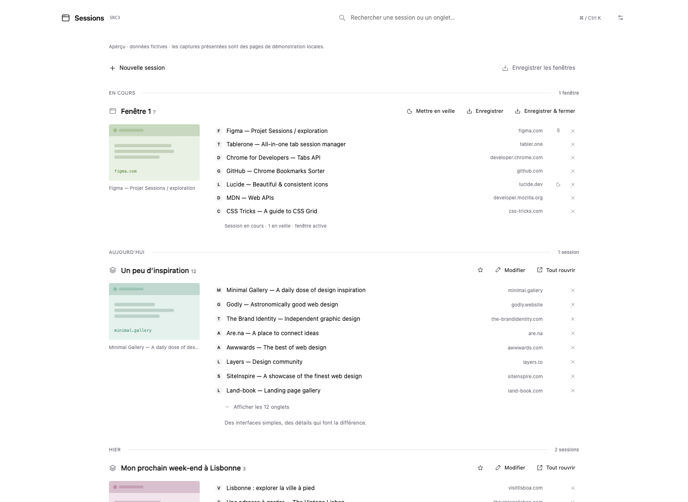

# Sessions · SRC3


[Français](README.md) · [English](README.en.md)

Rework of [src2](../src2/README.en.md) matching how Tablerone actually works: **a sober, frameless timeline** where the current session is **always expanded**, every line has its **close cross**, and a **page preview** replaces the favicon mosaic. **Version 2026.09.2** · Chrome Manifest V3 · no dependencies or build step. French interface.



## Installation

1. Open `chrome://extensions` (Chrome 120+).
2. Enable **Developer mode**.
3. **Load unpacked** → select **this `src3/` folder**.
4. Click the **Sessions · PK — SRC3** icon (shortcut ⌘⇧Y / Ctrl⇧Y, customizable at `chrome://extensions/shortcuts`).

Coexists with `../extension/` and `../src2/` (separate storages).

## What changed compared to src2

- **Tablerone-like timeline**: no bordered cards, no side menu — open windows on top (always expanded), then saved sessions grouped by day, expandable **in place** (no dialog).
- **One cross per row**: closes the tab of the live session (archived copy, undoable) or removes the link from a saved session (recovery copy + “Undo”).
- **Hover preview**: a single sticky capture on the left follows the hovered or keyboard-focused row — no more favicon grid.
- **Wide view**: clicking the preview widens the page (1400 px), enlarges the capture (360 px) and shows advanced options; second click or Esc collapses.
- **Direct saving**: “Enregistrer les fenêtres” or “Enregistrer & fermer” act immediately, with no intermediate form.
- **Local captures**: the service worker photographs pages you actually view (never incognito, never sent to an external service). See Permissions.
- **Light/dark/system theme**, ⌘K search, per-link notes, deduplication, archives with restore/permanent delete.

## How captures work

The worker waits ~1.1 s of stable display, then captures the **visible tab** of a **normal, focused window** (never incognito, never artificially activated, never while loading). The image is downscaled (440 px wide, JPEG ≈ 55%), kept **30 days** in local storage (60 captures / 2 MB max), then served on row hover. Can be disabled in settings. A page never visited since installation simply has no preview.

## Permissions

| Permission | Purpose |
|---|---|
| `tabs`, `tabGroups` | Read titles/URLs, reopen, close, sleep tabs, recreate groups |
| `storage`, `alarms` | Library, captures, periodic backup (5 min) |
| `favicon` | Icons through Chrome’s internal mechanism |
| `<all_urls>` (host) | **Only** `tabs.captureVisibleTab` for local captures; no injected scripts, no network requests to sites |

## Data and limits

- Local-only, no account or tracking. Uninstalling deletes data: **export JSON** regularly (settings).
- JSON import (`pk-sessions`, schema 1) is additive; 10 MB / 2,000 sessions / 5,000 tabs max, fully validated before writing.
- Automatic backup (every 5 min, 20 distinct versions) never closes tabs; favoriting makes a permanent collection.
- Closing a tab via its cross first creates an archived copy (undoable), then closes; pinned tabs are included, unlike bulk cleanup.
- Tab sleep (15/30/60 min) protects active, pinned and audible tabs; disabled by default.
- No cloud sync, hosted sharing, or proprietary Tablerone-format import.

## Checks and preview

```sh
node --test src3/tests/sessions.test.mjs
python3 -m http.server 8769 --bind 127.0.0.1 --directory src3
```

Then open <http://127.0.0.1:8769/?demo> (fictional preview without tab access; `&expand&highlight` pre-expands and widens). 21 tests cover among others: local captures (freshness, pruning), tab closing with prior backup and refusal when the URL changed, link removal + undo, deletion restricted to archived copies, failed writes without closing, group restoration, concurrent writes.

Documentation screenshots come from the `?demo` preview (fictional data). Recommended manual check after installing: row hover, close cross + “Undo”, preview click (wide view), “Enregistrer & fermer” then “Tout rouvrir”.

## Structure

```text
manifest.json   Directly installable extension
sw.js           Chrome API, local captures, serialized writes
core.mjs        Validation, search, removals, capture pruning
index.html      Interface (timeline)
style.css       Sober monochrome, light/dark
app.js          Rendering and interactions
tests/          Dependency-free tests + simulated API for the preview
store/          Fictional screenshots and presentation
```

History: [CHANGELOG](CHANGELOG.md) · References: [Tablerone](https://tabler.one/) (FAQ, changelog, glossary) — independent implementation, no proprietary code or visuals reused.
