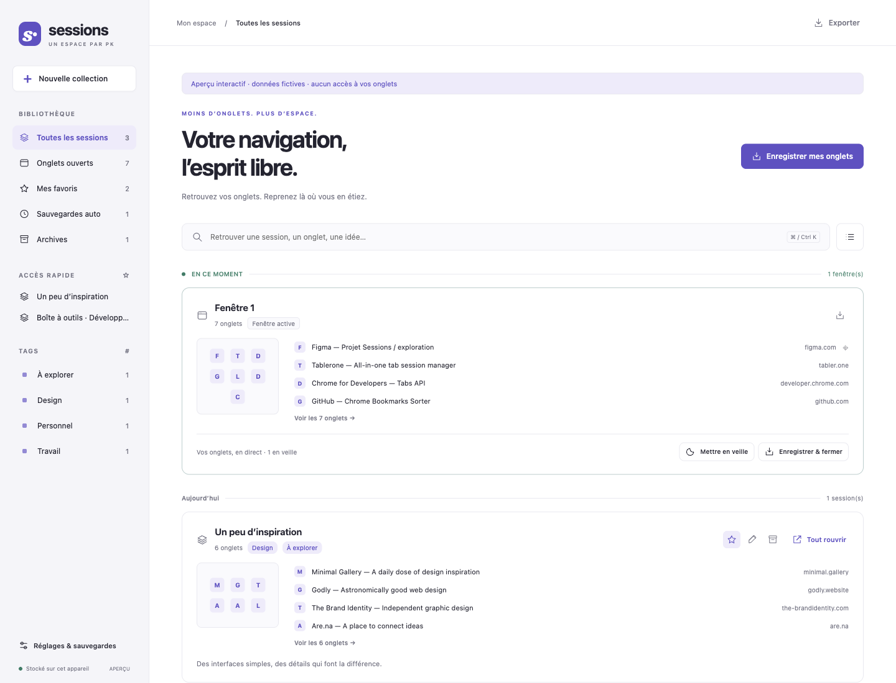
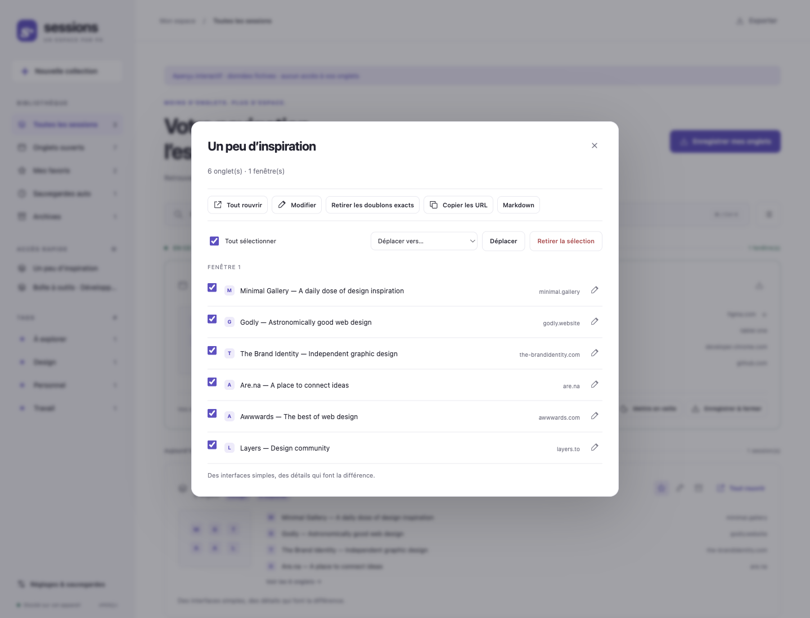

# Sessions · PK


[Français](README.md) · [English](README.en.md)

Une petite extension **inspirée de Tablerone** pour retrouver ses onglets et reprendre ses sessions. **Version 2026.09.1** · Chrome Manifest V3 · 100 % local · aucune dépendance ni compilation.



## Installation

1. Ouvrir `chrome://extensions` dans Chrome 120+ (ou un navigateur Chromium compatible).
2. Activer le **Mode développeur**.
3. Cliquer sur **Charger l’extension non empaquetée**, puis sélectionner **ce dossier `src2/`**.
4. Épingler **Sessions · PK** dans la barre d’outils et cliquer sur son icône.

L’interface s’ouvre dans un onglet ordinaire. Le raccourci **⌘⇧Y / Ctrl⇧Y** l’ouvre également ; il est personnalisable dans `chrome://extensions/shortcuts`. L’extension ne remplace pas la page Nouvel onglet. Elle peut cohabiter avec Favoris (`../extension/`) et dispose de son propre stockage.

## Fonctionnalités

| Fonction | Comportement |
|---|---|
| Timeline | Fenêtres ouvertes en direct, puis collections classées par date |
| Enregistrement | Toutes les fenêtres, une fenêtre ou les onglets sélectionnés dans son détail |
| Enregistrer & fermer | Écriture locale avant fermeture ; les onglets épinglés ou ayant changé d’URL restent ouverts |
| Restauration | Nouvelles fenêtres, groupes natifs, couleurs, onglets épinglés et onglet actif |
| Collections | Création à partir de liens, titre modifiable, favoris, tags, notes par collection et par onglet |
| Organisation | Déplacement d’une sélection vers une collection, retrait et dédoublonnage d’URL exactes |
| Recherche | Titres, URL, tags et notes dans la section courante ; **⌘K / Ctrl K** pour accéder au champ |
| Archives | Archivage réversible ; copie précédente conservée avant modification/retrait d’onglets ou dédoublonnage |
| Sauvegardes auto | Toutes les 5 minutes, 20 versions différentes maximum ; aucune fermeture ; un favori devient une collection permanente |
| Mise en veille | Manuelle, ou après 15/30/60 minutes d’inactivité ; les onglets actifs, épinglés et audibles sont protégés |
| Import/export | JSON Sessions, ajout sans écrasement ; copie de la sélection en URL brutes ou Markdown |
| Interface | Clair/sombre/système, densité compacte, navigation clavier et dialogues natifs |

Pour conserver une sauvegarde automatique durablement, ajoutez-la aux favoris ou modifiez son titre. Une session rouverte reste enregistrée et peut être rouverte de nouveau.



## Données et limites

- Données dans `chrome.storage.local`, isolées par profil. Pas de compte, de serveur, de suivi ni de requête vers un service de miniatures. Les favicônes utilisent le mécanisme interne de Chrome ; l’aperçu de développement utilise des initiales.
- Le stockage local a le quota standard de Chrome (10 Mo). Une écriture qui échoue affiche une erreur et n’entraîne aucune fermeture. **Exporter régulièrement le JSON** vers un emplacement externe : désinstaller l’extension supprime ses données locales.
- Les instantanés automatiques peuvent manquer les changements survenus entre deux passages, ou pendant l’arrêt du navigateur. Les 20 instantanés conservés ne constituent pas un historique exhaustif ni une garantie de récupération après crash. **Enregistrer & fermer** est la voie explicite pour conserver des onglets avant leur fermeture.
- Seules les URL HTTP(S) sont enregistrées/restaurées. Les fenêtres privées, pages internes et fichiers locaux sont exclus. Les URL HTTP(S) contenues dans les paramètres `url`/`uri` des pages de suspension sont récupérées lorsque possible.
- La mise en veille native peut faire perdre des formulaires non enregistrés. Elle est **désactivée par défaut** ; enregistrer son travail avant de l’activer.
- Collections indépendantes des favoris Chrome. Pas de synchronisation Google Drive/mobile, partage hébergé, capture automatique des pages ni import du format propriétaire Tablerone dans cette V1.
- JSON d’import : format `pk-sessions`, schéma `1`, maximum 10 Mo / 2 000 sessions / 5 000 onglets par session. Validation complète avant écriture. Les réimports ajoutent des copies avec de nouveaux identifiants ; les réglages restent ceux de l’installation courante.

### Permissions

| Permission | Utilisation |
|---|---|
| `tabs` | Lire titres/URL, retrouver, enregistrer, rouvrir, fermer explicitement et mettre en veille les onglets |
| `tabGroups` | Lire et recréer les groupes natifs |
| `storage` | Bibliothèque et réglages locaux |
| `alarms` | Sauvegarde périodique et vérification des onglets inactifs |
| `favicon` | Icônes via le mécanisme interne du navigateur |

Aucune permission d’accès global aux sites, aucun script injecté dans les pages.

## Vérifications et aperçu

Depuis la racine du dépôt (Node 22+ pour les tests) :

```sh
node --test src2/tests/sessions.test.mjs
python3 -m http.server 8768 --bind 127.0.0.1 --directory src2
```

Ouvrir ensuite **http://127.0.0.1:8768/?demo**. Cet aperçu utilise les mêmes opérations métier avec une API Chrome simulée et des données fictives en mémoire. Un rechargement le réinitialise. Il n’accède pas aux vrais onglets. En mode extension, `?demo` n’active pas la simulation.

Les tests couvrent notamment les imports malveillants, la sauvegarde avant fermeture, l’échec de stockage, les changements d’URL, la restauration des groupes, les onglets protégés, la rotation des sauvegardes et les écritures concurrentes. Les captures de cette documentation proviennent de l’aperçu, pas de données personnelles.

### Vérification manuelle après installation

Ouvrir deux onglets de test, épingler l’un, créer un groupe, puis tester **Enregistrer & fermer** et **Tout rouvrir**. Vérifier ensuite un export/import et le maintien des données après rechargement de l’extension. Ce contrôle exerce les véritables API Chrome, en complément des tests simulés.

## Structure

```text
manifest.json   Extension installable directement
sw.js           API Chrome et écritures sérialisées
core.mjs        Validation, recherche et transformations
index.html      Interface
style.css       Thèmes et mise en page responsive
app.js          Interactions et rendu
tests/          Tests sans dépendance et API simulée pour l’aperçu
store/          Captures fictives et description FR/EN
```

## Références étudiées

- [Site Tablerone](https://tabler.one/)
- [FAQ](https://tabler.one/help-and-support/tag/faq/)
- [Changelog](https://tabler.one/help-and-support/tag/changelog/), notamment les versions 1.11.0 et 1.13.1
- [Interface & Glossary](https://tabler.one/help-and-support/interface-glossary/)
- [Organisation des onglets et sessions](https://tabler.one/help-and-support/organise-tabs-and-sessions/)

Implémentation indépendante : ni code ni identité visuelle propriétaires de Tablerone repris. Historique : [CHANGELOG](CHANGELOG.md).
